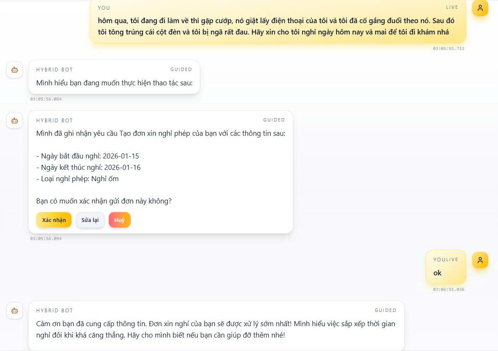

# Awesome-LLM-Chatbot-Router

<div align="center">


**Deterministic Precision. Semantic Intelligence. Hybrid Power.**


*Giao diện Chatbot Hybrid với khả năng xử lý ngôn ngữ tự nhiên vượt trội. Hệ thống kết hợp giữa Rule-based và Embedding, cho phép phản hồi tức thì trong vòng **0.3 giây** với độ chính xác cao, xử lý mượt mà các yêu cầu phức tạp như "hôm qua, tôi đang đi làm về thì gặp cướp, nó giật điện thoại của tôi và tôi đã cố gắng đuổi theo nó. Sau đó tôi tông trúng cột đèn và tôi bị nghã rất đau. Hãy xin cho tôi nghỉ ngày hôm nay và mai để tôi đi khám nhá" hay nhận diện ý định thay đổi ngữ cảnh linh hoạt.*

*A hybrid chatbot interface with advanced natural language understanding capabilities. The system combines rule-based logic and embedding-based models, enabling instant responses within **0.3 seconds** with high accuracy. It can smoothly handle complex requests such as: “Yesterday, on my way home from work, I was robbed and my phone was snatched. I tried to chase the thief, then crashed into a lamppost and was badly injured. Please request leave for me today and tomorrow so I can go for a medical check-up,” as well as flexibly recognize intent and context changes.*

</div>

---

### 🚀 What is this?
**Awesome-LLM-Chatbot-Router** is an enterprise-grade chatbot backend that intelligently routes user queries using a dual-engine approach: **Keyword Rules** for absolute precision and **Vector Embeddings** for semantic understanding.

### 💡 Why use it?
Pure LLMs can hallucinate; pure rules are too rigid. This project gives you **the best of both worlds**:
- **Zero Hallucinations** on critical business logic via deterministic rules.
- **Natural Understanding** of complex queries via semantic search (RAG-ready).
- **4x Faster** than previous versions using a Rust-accelerated engine.

### ⚡ How to run?
```bash
pip install -r requirements.txt && python scripts/run_server.py
```

---

## 🏎️ Quick Start

Get your chatbot running in under 2 minutes.

### 1. Backend Setup
```bash
# Clone the repository
git clone https://github.com/your-org/hybrid-intent-router.git
cd hybrid-intent-router

# Install dependencies
pip install -r requirements.txt

# Start the server (runs on port 8000)
python scripts/run_server.py
```

### 2. Frontend Setup (Optional)
```bash
cd frontend
npm install && npm run dev
```

### 3. Verify it works
Open a new terminal and test the routing API:

**Input:**
```bash
curl -X POST "http://localhost:8000/route" \
     -H "Content-Type: application/json" \
     -d '{"text": "I want to book a flight", "session_id": "demo-123"}'
```

**Output:**
```json
{
  "action": "book_flight",
  "confidence": 0.98,
  "source": "embedding_engine"
}
```

---

## ✨ Key Features

- **🧠 Dual-Engine Intelligence**: Seamlessly blends regex/keyword matching with state-of-the-art vector embeddings (`embed-anything`).
- **⚡ Rust-Powered Performance**: Core engine logic is optimized with Rust for high-throughput concurrency.
- **🔄 Hot Reloading**: Update your `keyword_rules.yaml` or `action_catalog.yaml` in real-time without restarting the server.
- **📅 Smart Slot Filling**: Built-in entity extraction for dates, numbers, and emails with context retention.
- **🛡️ Thread-Safe Architecture**: Designed for scale with robust locking mechanisms and atomic state updates.
- **🔌 Pluggable Vector Stores**: Supports In-Memory, FAISS, and Qdrant out of the box.

---

## 📚 Documentation

- [Architecture Overview](docs/ARCHITECTURE.md) - Deep dive into the hybrid engine design.
- [API Specification](docs/API_SPEC.md) - Complete endpoints reference.
- [Configuration Guide](docs/CONFIGURATION.md) - How to tune weights and rules.
- [User Manual](docs/USER_MANUAL.md) - Step-by-step usage guide.

---

## 🙋 FAQ

**Q: Do I need a GPU?**
A: No! The default embedding models are optimized for CPU usage, though a GPU will speed up indexing for massive datasets.

**Q: Can I use my own LLM?**
A: Yes, the architecture is model-agnostic. You can configure different embedding models in `.env`.

**Q: How do I add a new intent?**
A: Simply add a new entry to `config/action_catalog.yaml` and the system will automatically index it.

---

## 🤝 Community & Support

We love contributions! Please check our [Contribution Guidelines](CONTRIBUTING.md) and [Code of Conduct](CODE_OF_CONDUCT.md) before getting started.

- **Found a bug?** [Open an Issue](https://github.com/your-org/hybrid-intent-router/issues)
- **Want to contribute?** Check out [Good First Issues](https://github.com/your-org/hybrid-intent-router/labels/good%20first%20issue)
- **Discussions?** Join our [Discord/Slack Community](#)

---

<div align="center">

**Keywords**: ai-chatbot, chatbot-ui, rag, langchain, openai, llm, voice-chat, whatsapp-bot, nlp, fast-text, vector-search

Built with ❤️ by **ChinhLee**

</div>
