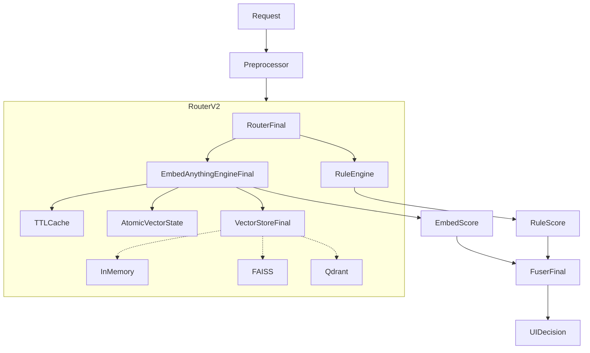
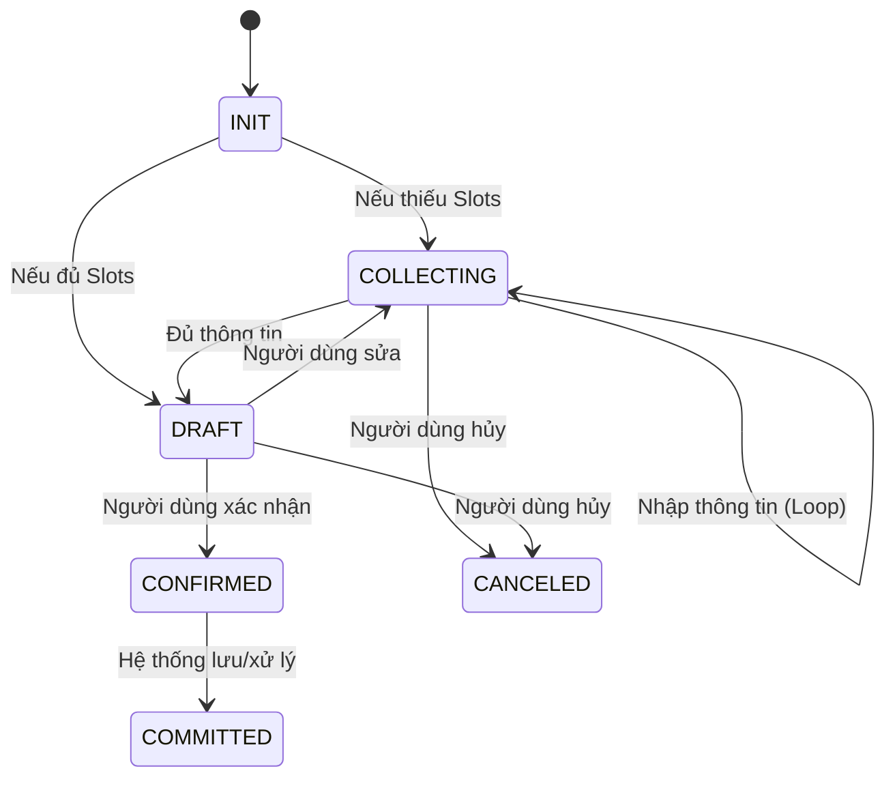

# Kiến trúc Hệ thống Hybrid Intent Router

Tài liệu này mô tả chi tiết kiến trúc kỹ thuật của hệ thống Hybrid Intent Router V2 (Production-grade).

## 1. Tổng quan

Hệ thống được thiết kế theo mô hình **Modular Monolith**, tách biệt rõ ràng giữa logic định tuyến (Routing) và logic thực thi (Execution).

### Các thành phần chính:
1.  **Router Pipeline (`app/router/`)**: Chịu trách nhiệm hiểu ý định người dùng (NLU) và điều hướng.
2.  **Action Flow Engine (`app/action_flow/`)**: Chịu trách nhiệm quản lý trạng thái hội thoại và thu thập thông tin.
3.  **API Layer (`app/main.py`)**: Lớp giao tiếp RESTful API (FastAPI).
4.  **Configuration (`config/`)**: "Bộ não" của hệ thống, định nghĩa hành động và luật lệ dưới dạng YAML.

---

## 2. Router Pipeline (V2 Architecture)

Kiến trúc V2 được tối ưu hóa cho hiệu năng cao, thread-safety và khả năng mở rộng.

### Sơ đồ Kiến trúc

### Các thành phần chi tiết:

#### `RouterFinal` (`app/router/router_final.py`)
- **Vai trò**: Orchestrator trung tâm.
- **Tính năng**:
    - Tích hợp Metrics collection (Latency, Cache hit rate).
    - Hỗ trợ Hot Reload an toàn với `AtomicConfigWatcher`.

#### `EmbedAnythingEngineFinal` (`app/router/embed_anything_engine_final.py`)
- **Core Engine**: Sử dụng `embed-anything` (Rust) để tăng tốc độ encode.
- **Pooling**: Sử dụng **Max Pooling** + **Per-seed Vectors** để giữ ngữ nghĩa chính xác hơn.
- **Fallback**: Cơ chế fallback tự động sang model dự phòng (BGE-Small/MiniLM) hoặc Mock mode nếu gặp sự cố driver.

#### `VectorStoreFinal` (`app/router/vector_store_final.py`)
- **Abstraction Layer**: Cho phép thay đổi backend lưu trữ vector (Memory/FAISS/Qdrant) mà không sửa code logic.
- **Thread Safety**: Sử dụng `RWLock` và `Atomic Swap` để đảm bảo an toàn dữ liệu khi truy cập đồng thời.

#### `TTLCache` (`app/router/query_cache.py`)
- **O(1) Access**: Sử dụng `OrderedDict` cho LRU Cache.
- **Thread Safe**: Lock-protected cho mọi thao tác.

---

## 3. Action Flow Engine (AFE)

AFE hoạt động như một **Finite State Machine (FSM)** (Máy trạng thái hữu hạn) để quản lý phiên làm việc.

### Vòng đời trạng thái (State Lifecycle)

---

## 4. Deployment

- **Environment Variables**:
    - `VECTOR_STORE=memory`: Chọn backend lưu trữ.
    - `EMBEDDING_MODEL=BAAI/bge-small-en-v1.5`: Chọn model (mặc định BGE-Small).

- **Health Check**:
    - `/healthz`: Liveness probe.
    - `/readyz`: Readiness probe (check model load, config load).
    - `/stats`: Monitor metrics (latency, cache, error).
